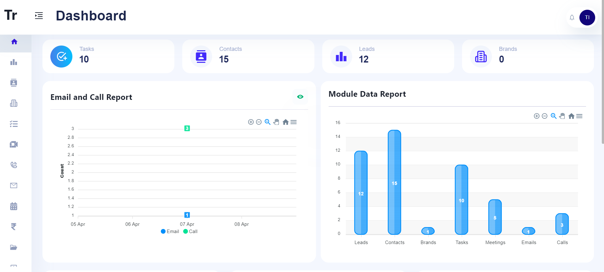

# BrandBridge CRM: Empowering Marketing Agencies with Modern CRM Tools

BrandBridge CRM is an innovative Customer Relationship Management (CRM) solution designed exclusively for Marketing Agencies. Streamline your workflow, enhance client interactions, and boost your business with our feature-packed CRM.

## Key Features

### 1. Intuitive Interface
- Navigate effortlessly through a user-friendly dashboard tailored precisely to the needs of Marketing professionals.
- Access critical information at your fingertips, ensuring swift decision-making and enhanced productivity.

### 2. MERN Stack Powered
- Harness the power of the robust MERN (MongoDB, Express, ReactJS, Node.js) stack, ensuring scalability, flexibility, and high performance.
- Leverage modern technologies to streamline your operations and stay ahead in today's competitive marketing landscape.

### 3. Customization
- Embrace the flexibility of an open-source architecture, allowing you to tailor the CRM to your unique business requirements.
- Customize fields, workflows, and features to align perfectly with your agency's processes and preferences.

### 4. Responsive Design
- Stay connected on the go with a responsive design that enables access to your CRM from any device, anywhere, anytime.
- Seamlessly manage leads, appointments, and client interactions whether you're in the office, at home, or on the move.

### 5. Seamless Communication
- Foster stronger client relationships with integrated communication tools that streamline interactions and enhance collaboration.
- Communicate effortlessly with clients, colleagues, and stakeholders to provide exceptional service and support.

## Features

### 1. Lead Management
- Efficiently manage leads and track their progress through the sales pipeline.
- Add, edit, or delete leads with ease.
- Organize leads based on various criteria such as status, source, or industry.

### 2. Communication Tools
- Seamlessly communicate with influencers, brands, and team members within the platform.
- Schedule meetings, calls, and tasks using the dynamic calendar feature.
- Collaborate on documents and share files securely.

### 3. Payment Processing
- Process payments to influencers securely through the integrated USD Stripe API.
- Keep track of payment history and invoices for each transaction.
- Ensure smooth and transparent transactions between brands and influencers.

### 4. Analytics and Reporting
- Generate detailed reports and analytics using graphical representations.
- Gain insights into lead conversion rates, brand engagement, and campaign performance.
- Make informed decisions to optimize marketing strategies and drive results.

### 5. Customization
- Customize the CRM interface to suit your workflow and preferences.
- Create forms, tables, and layouts using the drag-and-drop interface for easy customization.
- Tailor the platform to meet the unique needs of your agency and clients.

## Screenshots
Below are some screens from BrandBridge CRM:

## Accessing the Project
You can access the live demo of BrandBridge CRM hosted on Vercel. Simply click on the link below and use the following demo credentials:

- **Username:** demo_user
- **Password:** demo_password

[Access Demo](https://brandbridge-crm.vercel.app/)

